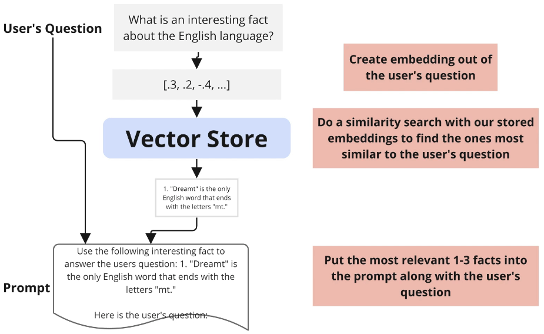

# ChatGPT-LangChain

## About:

- Description: Production-ready apps focused on real-world AI integration.
- Highlights:
- Tech stack: ChatGPT, LangChain, Python
- Overviews:
  - Integration:
    
    
  - Memory type: conversation summary
    
  - FactQA:
    
    

## Setup:

1. (For project isolation) create & activate a virtual environment (dependencies are installed within the virtual environment other than system-wide & all subsequent steps will be performed within the virtual environment):
   ```
   python -m venv env
   source env/bin/activate
   ```
2. Upgrade the pip package manager to the latest version within the current Python environment: `python -m pip install --upgrade pip`
3. Install libraries/packages:
   - Install the **_openai_** package with a version that is strictly before 1.0.0 (ensuring compatibility with versions before the major release) and the latest version of the **_langchain_** package:
     ```
     pip install "openai<1.0.0" langchain
     pip show openai langchain # display info about the installed packages
     ```
   - Install the python-dotenv library: `pip install python-dotenv`
   - Install the tiktoken package (It's developed by OpenAI to count the number of tokens in a given text. Tokens are chunks of text that can be as short as one character or as long as one word, depending on the language and the specific text): `pip install tiktoken`
   - Installs the Chroma database (a vector database optimized for storing and querying embeddings): `pip install chromadb`
4. Generate a snapshot of the installed packages and their versions to the requirements.txt file (or overwrite the txt file): `pip freeze > requirements.txt`, so others can install all the packages and their respective versions specified in the requirements.txt file with `pip install -r requirements.txt`
5. Create a symbolic link in each project directory from the .env file under the root directory:
   - `ln -s ../.env .env` (using a relative path to create a symbolic link; it's common practice to give a symlink the same name as its target for convenience, but we don't have to)
   - or `ln -s /.env .env` (using the absolute path)
   - or more generally `ln -s </target-directory/target-file> </symlink-directory/example-symlink>` (The </symlink-directory/> is optional. If not specified, the symlink is created in the current working directory.)
6. Run the code in each project directory: `python main.py`

## Study notes:

1. Document loaders: 
2. Embeddings: 
3. Semantic search: understanding the search context
   
4. Chain types:
   - stuff:
     
   - refine: LLM updates its response with further context (run in series)
     
   - map_reduce: build a summary of each document, then feed all summaries into the user's question
     
   - map_rerank: find relevant info within each document, then return the one with the highest relevance score
     

## Resources:

1. [.gitignore File – How to Ignore Files and Folders in Git](https://www.freecodecamp.org/news/gitignore-file-how-to-ignore-files-and-folders-in-git/)
2. [Create a symbolic link in Unix](https://kb.iu.edu/d/abbe)
